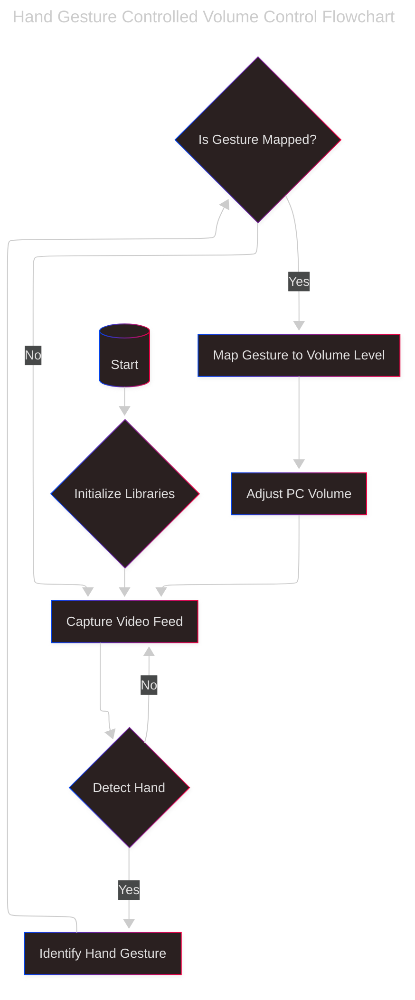

# Hand-Volume-Control
Python script to control system volume using hand gestures with OpenCV and MediaPipe.


# Hand Gesture Volume Control ✋🔊

Control your system volume using hand gestures with OpenCV and MediaPipe.

## Features
- 📏 Distance-based volume adjustment (thumb and index finger)
- 📊 Real-time volume bar visualization
- � Smooth audio transitions
- 📷 Camera feed with FPS counter





## Installation
1. Clone the repo:
   ```bash
      git clone https://github.com/shlok165/Hand-Volume-Control.git
      cd Hand-Volume-Control

2. Install Requirements:
   ```bash
      pip install -r requirements.txt

3. Run the main script:
   ```bash
      python volume_control.py


