# Hand-Volume-Control
Python script to control system volume using hand gestures with OpenCV and MediaPipe.


# Hand Gesture Volume Control ✋🔊

Control your system volume using hand gestures with OpenCV and MediaPipe.


## ✨ Features
- 🎮 **Gesture Control**: Adjust volume by changing distance between thumb-index fingers
- 📊 **Visual Feedback**: Real-time volume bar and percentage display
- 🔊 **Smooth Transitions**: No audio jumps during adjustment
- ⚡ **Optimized**: 30+ FPS performance on most webcams


## 📷 Camera Setup Guide

For optimal performance:
1. **Positioning**: 
   - Place the camera **1-2 feet** from your hand.
   - Ensure your **thumb and index finger** are fully visible in the frame.

2. **Lighting**:
   - Use **even lighting** (avoid backlighting or shadows on hands).
   - Natural daylight or diffused artificial light works best.

3. **Background**:
   - Prefer a **plain, contrasting background** (avoid patterns or colors similar to skin tones).

4. **Troubleshooting**:
   - If gestures aren't detected, adjust camera angle or check `detectionCon` in `handTrackingModule.py`.
   - Ensure no other objects (e.g., sleeves, jewelry) obstruct finger landmarks.

  ## 🛠️ Installation
```bash
# Clone repository
git clone https://github.com/shlok165/Hand-Volume-Control.git
cd Hand-Volume-Control

# Install dependencies
pip install -r requirements.txt

# Run the application
python volume_control.py
```

```mermaid
%%{init: {
  'theme': 'base',
  'themeVariables': {
    'primaryColor': '#0f0f17',
    'primaryBorderColor': '#4d4dff',
    'lineColor': '#6a00ff',
    'tertiaryColor': '#1a1a2e',
    'fontFamily': 'Arial, sans-serif'
  },
  'flowchart': {
    'nodeSpacing': 30,
    'rankSpacing': 50
  }
}}%%
flowchart TD
    classDef startEnd fill:#4d00ff:#8a2be2,stroke:#6a00ff,stroke-width:3,color:white,font-weight:bold,stroke-dasharray:5 5
    classDef process fill:#1e90ff:#00bfff,stroke:#4169e1,color:white
    classDef decision fill:#ff8c00:#ff4500,stroke:#ff6347,color:white
    
    A[("🎬 Start")]:::startEnd --> B{"📚 Init Libraries"}
    B --> C["🎥 Video Feed"]:::process
    C --> D{"✋ Hand Detected?"}:::decision
    D -- No --> C
    D -- Yes --> E["🤌 Gesture ID"]:::process
    E --> F{"🤔 Valid Gesture?"}:::decision
    F -- No --> C
    F -- Yes --> G["🔊 Volume Map"]:::process
    G --> H["💻 Adjust Volume"]:::process
    H --> C

    linkStyle default stroke:#6a00ff,stroke-width:2px
    linkStyle 0,2,4,6,8 stroke:yellow,stroke-width:2px
```




